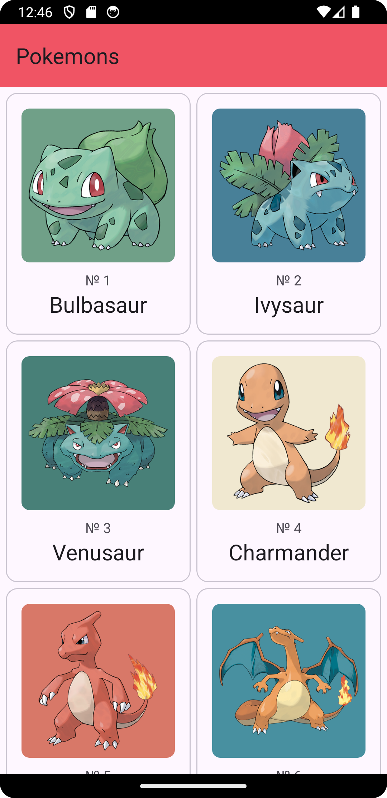
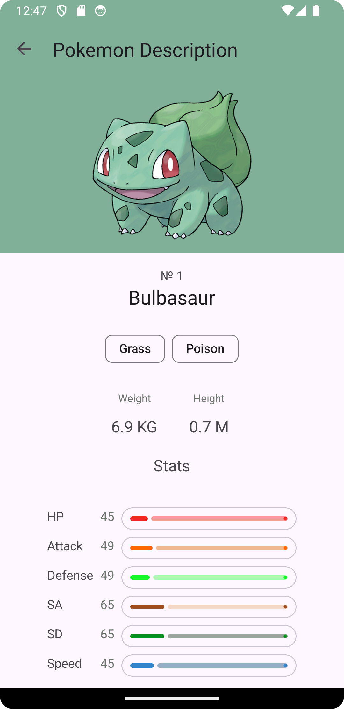

# Android PokemonApi

Implements of 2 screens displaying Pokemon:

1. The main screen of the Pokemon list.
2. Details screen with the selected Pokemon from the list.

   Used [Pokeapi](https://pokeapi.co/ "pokeapi")

## Technologies Used

- Kotlin
- ViewModel
- ViewBinding
- OkHttp 3+ Retrofit 2 and Coroutines.
- Paging 3
- Dagger Hilt

## Main screen

## Details screen

## Preview

